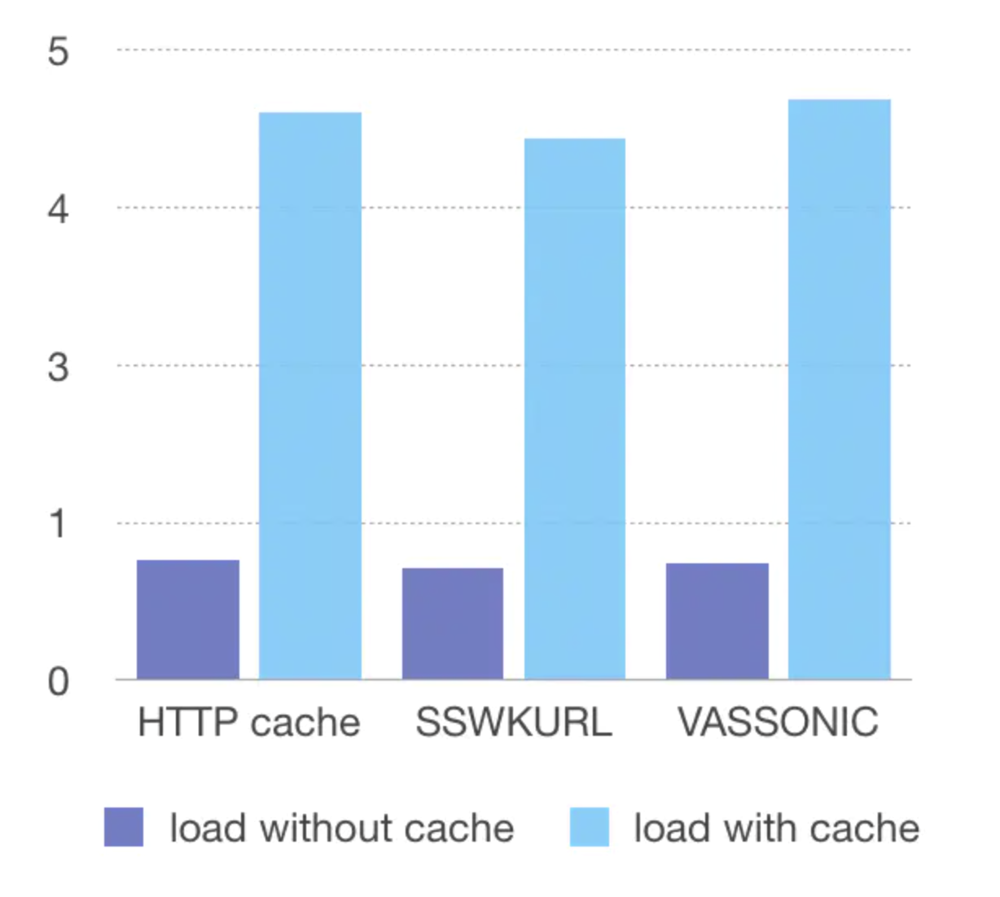

# SSWKURL

Intercept and cache requests of WKWebView.

介绍[iOS完美请求拦截](https://www.jianshu.com/p/7b28cbd8f92a)
[WKWebView缓存+请求拦截](https://www.jianshu.com/p/44f4fa1d3d12)

网易团队采用了原理相同但是更完整细致的解决方案,建议采用他们的:[WKWebView 请求拦截探索与实践](https://juejin.cn/post/6922625242796032007)

## Features

- Intercept All Requests of WKWebView.
- Cache requests.

## Perfomance

TestPage: 
https://www.bilibili.com/video/BV1rf4y1e7MD?p=2

Almost same with the cache in webview.But now we can control it without restriction.

## Installation

Drag the `SSWKURL.h` and `SSWKURL.m` files into your project.

## Usage

Subclass `SSWKURLProtocol` like `NSURLProtol`.

Implement your own `-startLoading:` and `-stopLoading`.

Then call `[yourWKURLConfiguration ssRegisterURLProtocol:[YourSSWKURLProtocol class]];`

Then You could moniter requests or load cache for requests.

## Compare to VasSonic

- support WKWebview
- iOS SDK > 12

## Blog

[WKWebView完美(?)网络请求拦截](https://www.jianshu.com/p/7b28cbd8f92a)
[WKWebView缓存+请求拦截](https://www.jianshu.com/p/44f4fa1d3d12)
网易团队采用了原理相同但是更完整细致的解决方案,建议采用他们的:[WKWebView 请求拦截探索与实践](https://juejin.cn/post/6922625242796032007)

